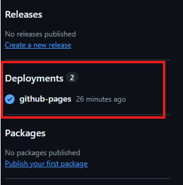
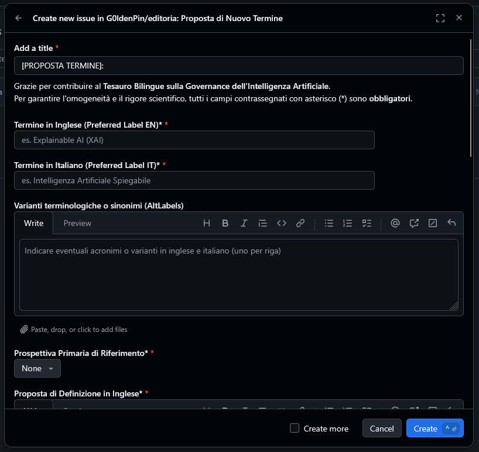
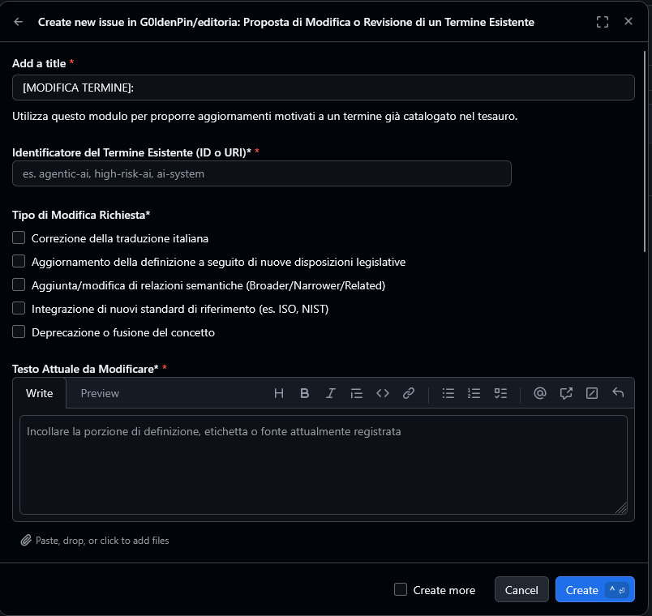

# Progetto d'Esame di Editoria Digitale (Appello 11/09/2026)

## Tesauro Bilingue sulla Governance dell'Intelligenza Artificiale

Progetto per la progettazione e documentazione di un **workflow editoriale digitale aperto, trasparente e tracciabile** per la gestione di un tesauro bilingue (inglese-italiano) dedicato alla governance dell'IA.

---

### Mappa dei File del Progetto

- **`relazione_esame.md`**: Relazione accademica completa redatta secondo il modello di relazione fornito su Ariel.
- **`diagram.bpmn`**: Modello formale del processo editoriale in formato standard XML **BPMN 2.0 (ISO/IEC 19510:2013)** generato tramite [bpmn.io](https://bpmn.io).
- **`diagram.svg`**: grafica vettoriale del diagramma BPMN 2.0.
- **`DECISIONS.md`**: Registro pubblico delle decisioni editoriali (*Editorial Decision Records - EDR*), con la verbalizzazione delle delibere di approvazione, revisione o rigetto delle proposte terminologiche.
- **`data/terms/*.md`**: Termini sorgente rappresentativi in formato **Markdown con frontmatter YAML conforme a W3C SKOS**.
- **`scripts/`**:
  - `validate_terms.py`: Script Python per verificare la correttezza formale, la simmetria bilingue e l'integrità referenziale delle relazioni semantiche.
  - `build_thesaurus.py`: Script Python per compilare i dati sorgente e generare i formati di consultazione (dataset JSON e portale statico HTML).
  - `issue_to_term.py`: Convertitore automatico da GitHub Issue Form a scheda termine Markdown/YAML con aggiornamento EDR.
- **`dist/`**: Artefatti compilati pronti per la pubblicazione su GitHub Pages:
  - `index.html`: Portale web statico, responsive e bilingue, con motore di ricerca e filtri sfaccettati.
  - `thesaurus.json`: Indice strutturato del tesauro e dataset per la ricerca client-side.
- **`.github/`**:
  - `workflows/deploy.yml`: Pipeline CI/CD su commit/merge e trigger manuale `workflow_dispatch`.
  - `workflows/publish_on_approval.yml`: Pipeline automatica ChatOps attivata dall'etichetta `approved` assegnata dal Chief Editor.
  - `ISSUE_TEMPLATE/`: Modelli strutturati per la raccolta di feedback dalla comunità (proposta di nuovi termini o revisione di termini esistenti) con campi obbligatori per motivazioni e citazioni di fonti/standard.

---

### Istruzioni per la Riproduzione del Flusso

Per verificare ed eseguire localmente il flusso di produzione documentale:

```bash
# 1. Posizionarsi nella cartella del progetto
cd editoria

# 2. Eseguire la validazione formale e semantica dei termini
python scripts/validate_terms.py

# 3. Compilare gli artefatti e rigenerare il portale web statico
python scripts/build_thesaurus.py

# 4. Aprire il portale web nel browser per consultare il tesauro interattivo
# (Ad esempio su Windows tramite terminale):
start dist/index.html
```

Per accedere al sito basta semplicemente cliccare "GitHub Pages" sotto a deployments. Non sono stati svolti test sull'effettiva pubblicazione di termini attraverso PR o issue, il contenuto del mockup infatti è costituito solo da esempi rappresentativi.

Sono stati testati i template delle ISSUE su GitHub e, come da foto allegate, funzionano perfettamente. I risultati dei test si possono consultare nelle due issue aperte.





---

### Consegne dell'Esercizio d'Esame

1. **Formato Sorgente**: Formato ibrido Markdown con YAML frontmatter strutturato e allineato a concetti semantici (SKOS). Massima leggibilità per un comitato interdisciplinare, perfetta gestione delle differenze riga per riga su Git, assenza di lock-in proprietari e compilazione automatica in JSON e HTML.
2. **Workflow di Pubblicazione**: Architettura di generazione di siti statici pilotata da Git. Pipeline GitHub Actions automatizzata che valida e compila i sorgenti ad ogni commit su `main`, distribuendo il portale su GitHub Pages.
3. **Raccolta Feedback**: Modelli dichiarativi GitHub Issue Forms con campi obbligatori per la motivazione analitica e la citazione puntuale delle fonti normative (es. AI Act) o degli standard tecnici (es. ISO/IEC 22989, NIST AI RMF).
4. **Flusso Editoriale e Giustificazioni Pubbliche**: Comitato interdisciplinare paritetico (*Legal*, *Technical*, *Philosophical Reviewer*) coordinato dal *Chief Editor*. Verbalizzazione trasparente di ogni delibera sia nel thread pubblico dell'issue/PR sia nel registro immutabile `DECISIONS.md`.
5. **Versionamento e Storico**: Adozione del Semantic Versioning 2.0.0 (*SemVer*), convenzione *Conventional Commits* e rilasci ufficiali versionati tramite Git Tags con identificatori persistenti.
6. **Visualizzazione**: Wireframe concettuale documentato nella relazione e prototipo web interattivo, funzionante e bilingue implementato in `dist/index.html`.
