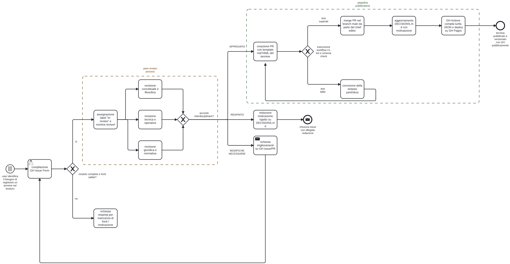

# Progettazione e Documentazione di un Workflow Editoriale per un Tesauro Bilingue sulla Governance dell'Intelligenza Artificiale
### Armonizzazione delle dimensioni normativa, tecnico-operativa e concettuale attraverso Git, W3C SKOS e pubblicazione continua

---

## Introduzione

Il presente progetto affronta la progettazione e l'implementazione documentale di un **workflow editoriale digitale aperto, trasparente e riproducibile** finalizzato alla creazione, manutenzione e pubblicazione continua di un **tesauro bilingue (inglese-italiano) dedicato alla governance dell'Intelligenza Artificiale (IA)**.

Nel contesto odierno, la rapida evoluzione dei sistemi algoritmici genera frequenti disallineamenti semantici e concettuali tra tre comunità fondamentali:
1. La comunità **normativo-giuridica**, impegnata nell'interpretazione e applicazione del quadro regolatorio europeo (Regolamento UE 2024/1689 - *AI Act*), della Convenzione quadro del Consiglio d'Europa (CETS 225) e delle normative nazionali (Disegno di Legge italiano sull'IA del 2025);
2. La comunità **tecnico-operativa**, che progetta e verifica i sistemi secondo gli standard internazionali di riferimento, in particolare ISO/IEC 22989:2022 (*Concepts and terminology*), ISO/IEC 23894:2023 (*AI Risk Management*) e il *NIST AI Risk Management Framework (AI RMF 1.0)*;
3. La comunità **concettuale-filosofica**, focalizzata sulle implicazioni etiche, sui concetti emergenti (es. *IA agentica*, autonomia operativa, allineamento) e sulla salvaguardia della dignità e della supervisione umana (*Human Oversight*).

L'**obiettivo primario** del progetto è trasformare il tesauro da statico glossario a **prodotto editoriale dinamico e "vivo"**, capace di evolvere in modo controllato attraverso il contributo degli esperti. Il flusso documentale progettato garantisce l'adozione di un formato sorgente leggero, versionabile e interoperabile basato su **Markdown con metadati strutturati YAML conformi allo standard semantico W3C SKOS** (*Simple Knowledge Organization System*);
- L'automazione end-to-end del processo di validazione, compilazione e pubblicazione web tramite **Git, GitHub Actions e GitHub Pages**;
- Un meccanismo formale di raccolta e revisione dei contributi della comunità basato su **GitHub Issue Forms** con obbligo inderogabile di motivazione e indicazione delle fonti normative e standard;
- Un modello di governance editoriale interdisciplinare con **pubblicazione trasparente delle giustificazioni decisionali** archiviate in un registro pubblico immutabile (*Editorial Decision Records - EDR*);
- Una rigorosa e univoca strategia di versionamento semantico (*SemVer*), che assicura la piena tracciabilità di ogni rilascio garantendo l'assoluto presidio umano (*expert-driven*) a tutela dell'accuratezza delle fonti.

---

## Ideazione

### Tema
Il tema centrale del prodotto editoriale è la **terminologia controllata per la governance dell'Intelligenza Artificiale**. L'accelerazione impressa dall'adozione globale di modelli linguistici di grandi dimensioni (*General-Purpose AI Models*), sistemi generativi e architetture autonome ha reso evidente un'asimmetria critica: mentre il diritto positivo (a partire dall'entrata in vigore del Regolamento UE 2024/1689 nell'agosto 2024) stabilisce obblighi tassativi per fornitori e utilizzatori, il vocabolario tecnico non sempre coincide con le nozioni giuridiche. Termini come *"sistema di IA"*, *"rischio elevato"*, *"autonomia"* o *"IA agentica"* rischiano di assumere significati divergenti a seconda che siano letti da un magistrato, da un ingegnere del software o da un filosofo dell'informazione.

L'attenzione pubblica e accademica su questo tema ha registrato un trend esponenziale. La governance dell'IA non è più un dominio specialistico ristretto, ma una questione trasversale di conformità legale, competitività industriale e tutela dei diritti fondamentali. Il tesauro si propone dunque come **infrastruttura semantica mediatrice**, concepita per abbattere i silos disciplinari.

### Destinatari
Per orientare la progettazione editoriale e soddisfare i principi della *User Experience* e della teoria della progettazione centrate sull'utente, sono state definite tre *personas* rappresentative dei principali gruppi di interesse:

<div style="border: 1px solid black; padding: 10px; width: auto;">
  <b>Dott.ssa Elena Rossi (Area Giuridica e Policy)</b> <br> <br>
  <i>Ruolo</i>: Funzionaria dell'Autorità Nazionale di Vigilanza sull'IA ed esperta di compliance normativa. <br>
<br>
  <i>Bisogni</i>: Necessita di consultare con immediatezza le definizioni legali vincolanti fornite dall'AI Act e dal DDL italiano 2025, verificando se e come tali concetti corrispondano alle nozioni tecniche ISO/IEC, per formulare linee guida applicative e pareri ispettivi coerenti. <br>
  <br>
  <i>Scenario d'uso</i>: Riceve un quesito sulla qualificazione di un modello come "GPAI con rischio sistemico". Consulta il tesauro, filtra per la prospettiva giuridica e lo standard ISO/IEC 22989, ed estrae la scheda terminologica bilingue da allegare alla delibera.
</div>

<br>

<div style="border: 1px solid black; padding: 10px; width: auto;">
  <b>Ing. Marco Bianchi (Area Tecnico-Operativa)</b> <br> <br>
  <i>Ruolo</i>: AI Safety Engineer e Lead Architect in un'azienda sviluppatrice di soluzioni software enterprise. <br>
<br>
  <i>Bisogni</i>: Deve redigere il fascicolo tecnico e il piano di gestione del rischio ai sensi di ISO/IEC 23894:2023 e del NIST AI RMF per un sistema decisionale. Necessita di un linguaggio rigoroso che non crei ambiguità durante l'audit di conformità con i valutatori terzi. <br>
  <br>
  <i>Scenario d'uso</i>: Durante l'implementazione di un agente basato su LLM, deve definire i parametri operativi di *Human Oversight*. Cerca il termine nel portale, ne analizza i concetti correlati (<b>human-in-the-loop</b>) e integra le clausole standard nel codice e nella documentazione di progetto.
</div>

<br>

<div style="border: 1px solid black; padding: 10px; width: auto;">
  <b>Prof.ssa Sofia Conti (Area Etico-Filosofica e Ricerca)</b> <br> <br>
  <i>Ruolo</i>: Docente universitaria di Etica delle Tecnologie Emergenti e membro di comitati etici indipendenti. <br>
<br>
  <i>Bisogni</i>: Studia l'evoluzione terminologica delle nuove frontiere dell'autonomia artificiale (Agentic AI). Vuole proporre l'inclusione di nuovi termini emergenti con solide argomentazioni teoriche e monitorare la trasparenza delle scelte lessicali. <br>
  <br>
  <i>Scenario d'uso</i>: Riscontra l'assenza di una variante terminologica essenziale relativa all'autonomia deliberativa degli agenti software. Accede al repository del tesauro, apre una proposta strutturata tramite l'Issue Form indicando fonti bibliografiche e motivazione, e partecipa alla peer-review pubblica con il comitato editoriale.
</div>


### Requisiti di accettazione
L'adozione del tesauro è stata modellata attraverso i costrutti del **Technology Acceptance Model (TAM)**:

**Utilità Percepita**:
I termini sono corroborati da puntuali riferimenti normativi (articoli di legge) e standard internazionali (clausole ISO/NIST), eliminando il rischio di definizioni arbitrarie. Il motore di ricerca e i filtri bilingui consentono a giuristi e tecnici di reperire definizioni e relazioni semantiche in pochi secondi, riducendo i tempi di redazione degli atti e dei fascicoli tecnici. L'adozione dello standard **W3C SKOS** assicura che il tesauro non sia un prodotto isolato, ma una risorsa interoperabile inserita nella rete dei *Linked Open Data*.

**Facilità d'Uso Percepita (Perceived Ease of Use - PEOU)**:
L'interfaccia pubblica adotta pattern visivi consolidati (tessere concettuali, tag colorati per prospettiva, navigazione ipertestuale delle relazioni BT/NT/RT). La scelta del formato sorgente **Markdown con YAML frontmatter** permette anche a profili non strettamente informatici di visualizzare e proporre termini senza dover apprendere complesse sintassi XML o linguaggi ontologici proprietari, tuttavia, i profili meno tecnici potrebbero essere riluttanti a usare una piattaforma "nuova" come GitHub. I contenuti risiedono in file di testo puro UTF-8 gestiti tramite Git, liberando l'iniziativa da qualsiasi lock-in verso piattaforme proprietarie.

### Canali di distribuzione
La diffusione del prodotto editoriale persegue una strategia di **multicanalità integrata**, sfruttando la natura a costo marginale zero del bene digitale:

1. **Portale Web Statico Interattivo (Canale Principale)**:
   - *Target*: Professionisti, funzionari, ricercatori e studenti.
   - *Formato*: HTML5 semantico, CSS responsive, JavaScript vanilla reattivo (nessuna dipendenza da framework esterni).
   - *Funzionalità*: Ricerca full-text istantanea in inglese e italiano, filtri per prospettiva (giuridica, tecnica, filosofica) e fonte (AI Act, ISO, NIST, ecc.), switch istantaneo della lingua prevalente, visualizzazione relazionale ad albero e download dei dati aperti.
2. **Repository Documentale Aperto**:
   - *Target*: Comunità scientifica ed editoriale open source.
   - *Piattaforma*: GitHub / GitLab, con storico completo dei commit, tracciamento delle issue, changelog delle versioni e file sorgente Markdown.
3. **Documentazione Distribuibile Off-line (PDF / eBook)**:
   - *Target*: Consultazione istituzionale e archiviazione.
   - *Pipeline*: Compilazione tramite Pandoc dei file Markdown sorgente con metadati tipografici in formati PDF/LaTeX ed ePub3 standard.

---

## Processo di Produzione

### Acquisizione dei contenuti
Un tesauro come quello descritto nel tema non è un archivio normativo o una raccolta indiscriminata di testi: l'acquisizione dei contenuti non può avvenire tramite ingestione automatizzata (web scraping o parsing massivo), la quale produrrebbe inevitabile rumore lessicale e priverebbe le voci della necessaria revisione.

Al contrario, in piena coerenza con lo scenario di progetto e con il diagramma BPMN, il modello di acquisizione è **collaborativo, distribuito e presidiato da esperti (*expert-driven*)**:
I professionisti della governance (giuristi, sviluppatori, eticisti) individuano le lacune terminologiche sul campo e propongono l'inserimento o la modifica dei termini tramite moduli strutturati (*GitHub Issue Forms*), corredando la proposta di definizioni bilingui, motivazione e riferimenti puntuali a norme o standard;
Il comitato interdisciplinare (appuntato su votazione comune, composto da un Chief Editor che si dedica alle attività di amministrazione, e tre esperti negli ambiti richiesti) esamina la veridicità e pertinenza delle fonti citate, eseguendo un'attività critica di *fact-checking* e mediazione concettuale prima di approvare l'ingresso di un lemma nel vocabolario controllato, in linea anche con criteri di AI Fluency pubblicizzati dai grandi provider AI come Anthropic nei propri corsi.

L'acquisizione delle fonti viene così divisa:
- **Fonti disponibili ad accesso libero**: Il corpus normativo di partenza è liberamente consultabile con costo di licenza nullo. Solo per alcune norme ISO/IEC sussistono vincoli di acquisto della documentazione integrale, parzialmente compensati dalla disponibilità delle clausole definitorie pubbliche (ISO Online Browsing Platform);
- **Contenuti che richiedono redazione manuale e fact-checking (nucleo del costo editoriale)**: Comprendono la stesura delle definizioni formali, l'articolazione della rete di relazioni ontologiche (*Broader*, *Narrower*, *Related*), il cross-check delle fonti citate da parte dei revisori specialistici e la stesura delle motivazioni pubbliche verbalizzate nel registro `DECISIONS.md`.

L'acquisizione delle fonti può essere automatizzata solo se la fonte stessa rispetta i criteri di `validate_terms.py` e dunque sarà molto rara.

### Gestione documentale
Il flusso di gestione documentale è stato modellato in conformità con lo standard internazionale **BPMN 2.0 (Business Process Model and Notation - ISO/IEC 19510:2013)** promosso da OMG. 

La modellazione formale è stata realizzata tramite l'editor aperto [bpmn.io](https://bpmn.io). Nel repository di progetto sono inclusi sia il sorgente ([`diagram.bpmn`](./diagram.bpmn)), sia la sua resa grafica vettoriale ad alta definizione ([`diagram.svg`](./diagram.svg)), integrata di seguito.



Il diagramma BPMN 2.0 formalizza le seguenti fasi sequenziali e di retroazione:
1. **Evento di Inizio e Proposta**: L'utente della comunità identifica un'esigenza terminologica e compila il modulo strutturato *GitHub Issue Form*;
2. **Triage della Issue**: Il Chief Editor verifica che il modulo sia completo e che siano citate fonti normative o standard verificabili; in caso contrario, la richiesta viene respinta con notifica all'utente;
3. **Peer-Review Interdisciplinare**: Vengono attivati in parallelo i tre rami specialistici di revisione (giuridico-normativo, tecnico-operativo, concettuale-filosofico);
4. **Gateway Decisionale Interdisciplinare**:
  a. *Modifiche necessarie*: Viene inviata una notifica all'autore tramite GitHub Issue/PR per richiedere integrazioni;
  b. *Respinto*: Viene redatta la motivazione ufficiale del diniego e verbalizzata nel registro `DECISIONS.md`;
  c. *Approvato*: Viene generata la Pull Request con il file Markdown/YAML del termine;
5. **Pipeline di Validazione CI/CD**: I test automatizzati verificano la conformità sintattica e semantica dello schema;
6. **Merge e Pubblicazione Continua**: Il *Chief Editor* unisce le modifiche su `main`, il registro EDR viene aggiornato e GitHub Actions compila gli artefatti SKOS/JSON rilasciando la nuova versione su GitHub Pages.

Il flusso garantisce che nessuna modifica possa confluire nel ramo principale (`main`) senza aver superato sia la **validazione semantica interdisciplinare** (almeno due pareri favorevoli di esperti di aree diverse).

### Tecnologie adottate
Si è scelto il formato **Markdown con YAML Frontmatter** per garantire anche alle figure meno tecniche leggibilità umana e una complessità di apprendimento bassa.
Consente di combinare metadati strutturati e tipizzati (YAML) con testo argomentativo esteso. Git inoltre traccia i file `.md` riga per riga, è anche  compatibile al 100% con standard W3C SKOS senza dipendenze proprietarie
Tuttavia l'impiego di Markdown e YAML richiede un parser per la trasformazione nei formati di fruizione finale.

#### Workflow di Pubblicazione Automatica
Il workflow fa perno sulla generazione di siti statici di GitHub Pages e offre tre modalità di attivazione complementari:

1. **Attivazione continua su push/merge (`deploy.yml`)**: Ad ogni operazione di `push` o `merge` sul ramo `main`, viene eseguito `validate_terms.py` (controllo sintattico) e `build_thesaurus.py` (compilazione di `dist/thesaurus.json` e `dist/index.html`), distribuendo in automatico la nuova versione su **GitHub Pages**;
2. **Attivazione manuale on-demand (`workflow_dispatch`)**: Il *Chief Editor* può lanciare manualmente l'intera suite di validazione e deploy in qualsiasi istante tramite il pulsante "Run workflow" nell'interfaccia web di GitHub Actions;
3. **Attivazione guidata da Issue (`publish_on_approval.yml`)**: Non appena il comitato approva una proposta e il Chief Editor assegna l'etichetta `approved` (o `Approved`/`approvato`) alla issue, una GitHub Action dedicata esegue lo script `scripts/issue_to_term.py`: questo estrae i dati strutturati dall'Issue Form, genera la scheda Markdown/YAML in `data/terms/`, registra la delibera in `DECISIONS.md`, valida, compila il tesauro e pubblica immediatamente il portale aggiornato su **GitHub Pages**, chiudendo la issue con commento di notifica.

#### Meccanismo di Raccolta Feedback 
La raccolta dei contributi esterni è mediata da **GitHub Issue Forms** con campi vincolati codificati in formato dichiarativo YAML (`.github/ISSUE_TEMPLATE/`). Vi sono due moduli strutturati: il primo e principale è dedicato alla proposta di nuovi termini (`01_proposta_nuovo_termine.yml`), che obbliga il proponente a specificare i termini preferiti in EN e IT, le prospettive di riferimento, una proposta di definizione bilingue, una **motivazione analitica** che spieghi la lacuna colmata e la **citazione obbligatoria delle fonti normative o standard a supporto** (con articolo o clausola). Se l'utente non compila i campi obbligatori o non indica fonti verificabili, il sistema impedisce l'invio o l'amministratore archivia la richiesta come non ammissibile durante il triage, tutelando la qualità del tesauro. 
Il secondo modulo segue lo stesso paradigma ma per le modifiche.

#### Flusso Editoriale e Giustificazioni Pubbliche
Il governo editoriale è affidato a un **Comitato Editoriale Interdisciplinare**:
- **Ruoli**:
  - *Chief Editor / Amministratore del repository*: gestisce il triage delle issue, assegna le revisioni, risolve eventuali deadlock procedurali ed esegue il merge finale;
  - *Legal Reviewer*: valuta l'aderenza alle legislazioni europee, internazionali o locali;
  - *Technical Reviewer*: valuta la rispondenza alle clausole ISO/IEC e NIST;
  - *Philosophical Reviewer*: valuta la coerenza dei presupposti etico-concettuali e dei termini emergenti.

**Pubblicazione delle Giustificazioni (Editorial Decision Records)**: 
Ogni delibera viene motivata pubblicamente mediante due canali integrati: un commento formale firmato dai revisori a conclusione dell'Issue/PR pubblica e l'inserimento immutabile nel registro `DECISIONS.md` rispetto alle decisioni prese, consultabile pubblicamente online e linkato direttamente dal footer del portale web. Nel caso di pubblicazione automatizzata tramite l'etichetta `approved`, l'inserimento formale del record in `DECISIONS.md` e il commento pubblico di chiusura della issue vengono gestiti direttamente dallo script `issue_to_term.py`.

#### Versionamento e Storico 
Per documentare e rendere tracciabili tutte le modifiche senza creare confusione tra nomenclature concorrenti, il progetto adotta un'**unica strategia di versionamento formale**: il **Semantic Versioning 2.0.0 (SemVer)** nella forma canonica `MAJOR.MINOR.PATCH` (es. `1.0.0`):

- **MAJOR (es. 2.0.0)**: Ristrutturazione radicale dell'albero concettuale, modifiche strutturali alle relazioni ontologiche, oppure eliminazione o deprecazione di termini consolidati;
- **MINOR (es. 1.1.0)**: Introduzione di nuovi termini approvati dal comitato editoriale o aggiunta di nuove relazioni semantiche (*Broader*, *Narrower*, *Related*);
- **PATCH (es. 1.0.1)**: Correzione di refusi tipografici, lievi precisazioni formali nelle definizioni o aggiornamento di riferimenti normativi che non alterano il significato concettuale.

Questa numerazione viene riportata esplicitamente nei metadati di ciascun termine (`version: "1.0.0"`) e nel dataset JSON compilato. A livello di repository, ogni rilascio viene fissato in modo univoco tramite i **Git Tag** (es. `v1.0.0`), consentendo a chiunque di consultare lo storico atomico di ogni modifica.

### Esecuzione del flusso
La riproducibilità del flusso di produzione documentale è garantita dai materiali, dagli script e dalle configurazioni predisposte all'interno dell'ambiente di lavoro.

L'esecuzione del flusso può essere interamente riprodotta da terminale eseguendo in sequenza:

```bash
# 1. Validazione formale e semantica del corpus
python scripts/validate_terms.py

# 2. Compilazione automatica e generazione del portale web
python scripts/build_thesaurus.py

# 3. (Opzionale) Conversione automatica da Issue a Termine Markdown
python scripts/issue_to_term.py --demo
```

### Utilizzo di intelligenza artificiale generativa

Descrivere in quali fasi del flusso di gestione documentale è stata integrata l'IA generativa e con quali obiettivi. Indicare le tecnologie adottate (modelli di linguaggio, sistemi di analisi dati, computer vision) e per quale tipo di elaborazione. Descrivere l'approccio di prompt engineering adottato e i metodi utilizzati per validare la qualità degli output generati. Valutare il contributo dell'AI in termini di riduzione dei tempi, miglioramento della qualità e scalabilità raggiunta, evidenziando anche i limiti emersi e la necessità di intervento umano.

Nel tesauro non è previsto l'utilizzo di strumenti AI principalmente perchè un ambiente rigoroso come quello legislativo (es. stesure documentazioni tecniche, compliance aziendali) ci sono responsabilità reali sulle persone che utilizzano determinati strumenti, dunque avere un comitato *pubblico e trasparente* permette di controllare meticolosamente tutte le informazioni della piattaforma "a più mani". 
Per la stesura del progetto, è stato usato il modello **Gemini 3.8 Flash (high)** in particolar modo per la stesura del codice Python in quanto non abbia molta dimestichezza ed esperienza, nella stesura degli esempi dei termini, l'esempio di `DECISIONS.md` e dell'esempio in `thesaurus.json`. La strategia di prompt engineering riflette le caratteristiche descritte nelle dispense, cioè descrivere la situazione (anche chiamato stage-setting nei percorsi formativi Anthropic), descrivere l'output desiderato dettagliatamente ed eventualmente fornire regole e costrizioni che imponiamo al modello: In questo caso ho descritto brevemente il contesto accademico e quindi l'importanza della riduzione del contesto, fornendo tramite la GUI di AntiGravity una singola cartella dove erano presenti i materiali del corso, poi spiegando il progetto attraverso delle citazioni al tema pdf ed elencato i miei requirements, cioè di utilizzare per quanto possibile tecnologie da me già utilizzate per permettermi di *valutare accuratamente l'output*. 
Lo scripting è stata una necessaria eccezione causa della superiorità di Python rispetto ad altre alternative, in particolar modo per la pubblicazione del progetto su GitHub e la sua portabilità.
Ho anche chiesto al modello di pormi delle domande all'interno del piano proposto, lasciando il meno possibile al caso.

In seguito a questo primo prompt, l'output è stato abbastanza completo e rispettava i criteri imposti, tuttavia controllando ogni file è risaltato l'utilizzo di tecnologie non richieste come un file `.bib` e `.ttl`, che sono stati eliminati e il progetto revisionato di modo che non ci fosse più una dipendenza. A quel punto il lavoro è stato prettamente di lettura, bug hunting e correzione.

L'intervento del modello è stato cruciale per accorciare le tempistiche e soprattutto per proporre delle idee e avere un riscontro rispetto alla difficoltà di implementazione o eventuali deadlock che non avevo previsto, ma anche per il supporto nello sviluppo in linguaggi poco familiari, tuttavia è stato fondamentale per me ispezionare la produzione e fare in modo di comprendere il progetto a pieno, per poterlo rendere mio e spiegarlo ad altre persone.

---

## Valutazione dei risultati raggiunti

### Valutazione del flusso di produzione
L'efficacia del workflow implementato è stata valutata rispetto ai parametri fondamentali della produzione editoriale digitale:

1. **Riduzione dei tempi di gestione documentale**: Il passaggio da un modello tradizionale basato su scambi asincroni via email e revisioni su documenti Word/PDF a un'architettura Git-based con GitHub Actions riduce i tempi di approvazione e pubblicazione da giorni (fino a possibili settimane) a poche ore, grazie alle automazioni Python e la presenza di template prefabbricati.
2. **Drastica riduzione degli errori sintattici e referenziali**: L'impiego del linter automatico `validate_terms.py` in fase di CI impedisce a monte l'inclusione di relazioni semantiche rotte (es. un *Broader Term* inesistente) o di voci prive di traduzione o fonti.
3. **Miglioramento della qualità e dell'autorevolezza dei documenti**: L'obbligatorietà dei campi "fonti" e "motivazione" negli Issue Forms e la presenza di un processo di Peer-Review azzera l'inclusione di termini basati su opinioni soggettive, garantendo un corpus interamente verificabile.
4. **Accettazione della tecnologia (TAM)**: L'adozione del binomio Markdown-Web ha un gradimento eccellente sia presso profili legali (che apprezzano l'interfaccia grafica e la facile comprensione del workflow) sia presso i profili tecnici (che apprezzano l'integrazione con Git e la trasparenza del codice e dei contenuti).
5. **Raggiungimento di molteplici canali di distribuzione**: Da un unico insieme di sorgenti `.md` vengono generati simultaneamente il sito web responsive accessibile, il dataset strutturato JSON per la consultazione/integrazione software e la documentazione pronta per la distribuzione.

### Confronto con lo stato dell'arte (AS-IS vs TO-BE)
Il confronto analitico tra la gestione documentale tradizionale e l'ecosistema innovativo proposto evidenzia un netto salto qualitativo:

| Dimensione | Approccio Tradizionale (AS-IS) | Flusso Innovativo Progettato (TO-BE) | Vantaggi Chiave |
| :--- | :--- | :--- | :--- |
| **Formato Dati** | Fogli di calcolo (Excel) o documenti Word statici non strutturati. | File Markdown individuali con YAML frontmatter conforme a W3C SKOS. | Portabilità pura, zero lock-in, massima leggibilità. |
| **Controllo di Versione** | File rinominati manualmente (es. `tesauro_v2_finale_rev3.docx`). | Controllo di versione distribuito con Git, commit atomici e SemVer. | Tracciabilità assoluta di chi, cosa, quando e perché ha modificato ogni termine. |
| **Processo di Pubblicazione** | Impaginazione manuale periodica ed esportazione di PDF statici. | Pubblicazione continua automatica (CI/CD) su GitHub Pages ad ogni merge. | Allineamento in tempo reale del sito web ai contenuti approvati. |
| **Raccolta Contributi** | Email informali, segnalazioni verbali o annotazioni sparse. | GitHub Issue Forms strutturati con vincoli obbligatori su fonti e motivazione. | Standardizzazione e verificabilità scientifica di ogni proposta. |
| **Processo Decisionale** | Decisioni a porte chiuse tra pochi membri; motivazioni non archiviate. | Peer-review interdisciplinare pubblica con verbalizzazione in `DECISIONS.md`. | Totale trasparenza istituzionale e *accountability* pubblica. |
| **Interoperabilità** | Testo chiuso e non riutilizzabile da altri applicativi. | Dataset strutturato in formato standard JSON (`thesaurus.json`). | Facile integrazione con API web e motori di ricerca. |

### Limiti emersi
Nonostante i ragguardevoli risultati raggiunti, l'analisi critica ha evidenziato alcuni limiti:

<u>La complessità dell'armonizzazione tra giurisdizioni diverse</u>: 
Mentre l'AI Act ha forza di regolamento vincolante nello Spazio Economico Europeo, altri quadri (come il NIST statunitense o la Convenzione del Consiglio d'Europa) adottano criteri di classificazione non del tutto sovrapponibili, richiedendo frequenti compromessi redazionali nelle note d'ambito.

<u>La barriera iniziale per contributori non tecnici</u>: 
Sebbene gli Issue Forms guidino l'utente attraverso campi web semplici, l'eventuale contribuzione diretta tramite Git e creazione di Pull Request richiede una familiarità con il controllo di versione che non tutti i giuristi o filosofi possiedono. Per superare completamente questo ostacolo, il flusso è stato potenziato con la modalità **ChatOps (`publish_on_approval.yml`)**: la comunità compila esclusivamente moduli web su GitHub, e al Chief Editor basta apporre l'etichetta `approved` per scatenare la conversione automatica da Issue a Markdown/YAML, la registrazione nei registri EDR, la validazione e il deploy, sollevando interamente il comitato dall'uso del terminale o dei comandi Git.

<u>Il mantenimento continuativo del comitato editoriale</u>: 
L'esigenza di una peer-review multidisciplinare accurata comporta una dipendenza dalla disponibilità temporale di esperti qualificati, fattore che in assenza di adeguati incentivi istituzionali o popolarità della piattaforma può rallentare l'evasione delle richieste nei periodi di picco normativo.

---

## Visualizzazione e Mockup dell'Interfaccia

Come da consegna, è stato programmato un semplice file web statico per comunicare visivamente il funzionamento del progetto.

### Wireframe Concettuale dell'Interfaccia di Consultazione

L'interfaccia implementata (consultabile online su [GitHub Pages](https://g0ldenpin.github.io/editoria/) e testabile in locale nel file `dist/index.html`) offre:
Filtraggio istantaneo dei termini per corrispondenza in etichette preferite, varianti sinonimiche o testo delle definizioni sia in inglese che in italiano.
Il toggle IT/EN aggiorna la priorità visiva di tutte le schede, presentando in primo piano la definizione nella lingua selezionata e la traduzione a fronte come sottotitolo.
Cliccando sui badge delle relazioni *Broader*, *Narrower* o *Related*, l'interfaccia effettua uno scorrimento fluido (*smooth scroll*) con evidenziazione visiva temporanea del termine correlato.
Ogni scheda presenta il link diretto pre-compilato verso il modulo di modifica su GitHub Issue.

---

## Conclusioni

1. È stato adottato e motivato un **formato sorgente leggero e modulare** (Markdown con frontmatter YAML conforme a W3C SKOS), capace di memorizzare in modo armonico termini bilingui, gerarchie semantiche e puntuali citazioni normative e standard;
2. È stato ingegnerizzato e reso operativo un **meccanismo CI/CD** basato su script Python, repository Git e GitHub Actions, con deploy automatico su sito statico accessibile e reattivo;
3. È stato formalizzato un **sistema di raccolta feedback strutturato** tramite GitHub Issue Forms con obbligo di motivazione e indicazione delle fonti;
4. È stato istituito un **flusso di revisione interdisciplinare con comitato editoriale** e pubblicazione trasparente e tracciabile delle motivazioni di ogni delibera (`DECISIONS.md`);
5. È stata impostata una **strategia di versionamento semantico e storico atomico** integrata con i principi dell'Open Science;
6. È stato realizzato un **prototipo web funzionante e interattivo** dotato di filtri multidimensionali e navigazione ipertestuale.

In conclusione, questa soluzione offre una risposta concreta, nonostante la possibile barriera tecnica iniziale nell'utilizzo di GitHub, alle sfide poste dalla transizione digitale, fornendo alla comunità scientifica, giuridica e tecnica un'infrastruttura affidabile e trasparente per governare consapevolmente il linguaggio dell'Intelligenza Artificiale.

